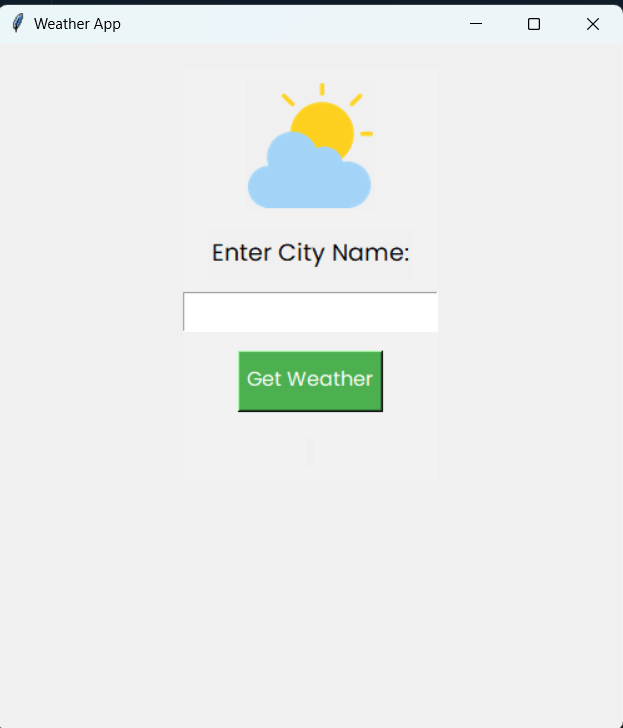

# 🌤️ Tkinter Weather App

A simple desktop GUI application built using **Python** and **Tkinter** to fetch real-time weather data from the [OpenWeatherMap API](https://openweathermap.org/api).  
It's clean, responsive, and beginner-friendly — great for learning or showcasing basic API integration with GUI logic.

---

## 📸 Preview



---

## 🚀 Features

- ✅ Real-time weather fetch by city name
- ✅ Clean GUI layout using `Tkinter`
- ✅ Input validation and error messages
- ✅ Loading indicator during fetch
- ✅ Styled UI using custom fonts, colors, and borders
- ✅ Uses `Pillow` for image handling

---

## 🛠️ Technologies Used

- Python 3.x
- Tkinter (GUI)
- `requests` (API call)
- `Pillow` (Image support)
- OpenWeatherMap API

---

## 📦 Installation & Setup

### 1. Clone the repository

```bash
git clone https://github.com/YOUR_USERNAME/weather-app-python.git
cd weather-app-python
```

### 2. Install required packages

```bash
pip install requests pillow
```

### 3. Add your OpenWeatherMap API key
Edit main.py and replace this line:
```bash
API_KEY = "YOUR_API_KEY_HERE"
```

### 4. Run the app
```bash
python main.py
```

_______

###  How It Works
1. User enters a city name.

2. On button click, app fetches live weather data using OpenWeatherMap API.

3. Weather info (temperature, description) is displayed inside the GUI.


### Project Structure

```
weather-app-python/
├── main.py
├── weather.png       # Weather icon (optional)
└── README.md
````

## License
This project is open-source and free to use under the MIT license.

## 🙌 Acknowledgements
OpenWeatherMap for the weather API

Pillow for image support

You — for visiting this repo! ❤️